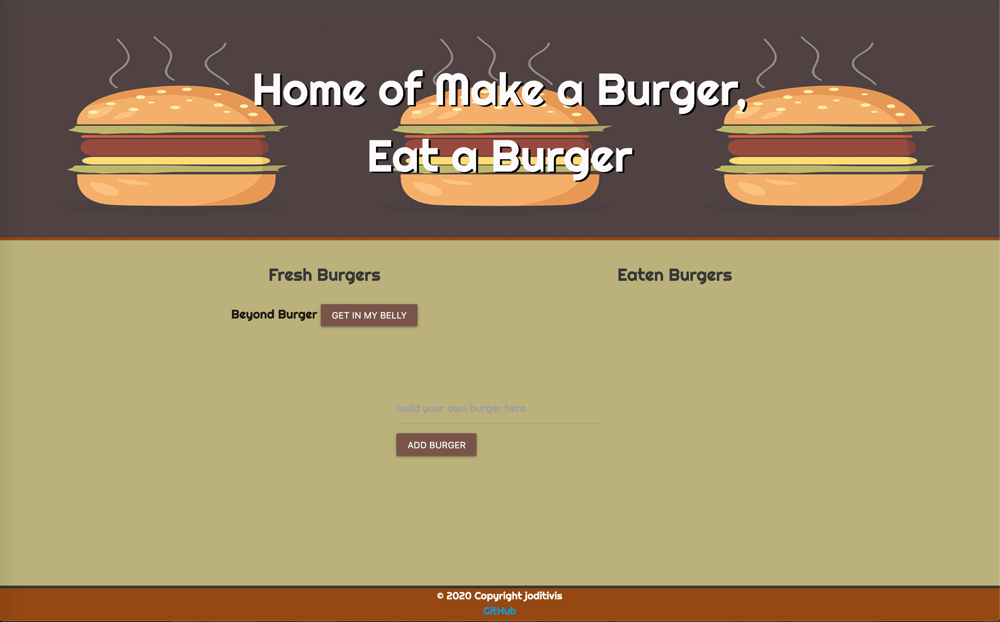
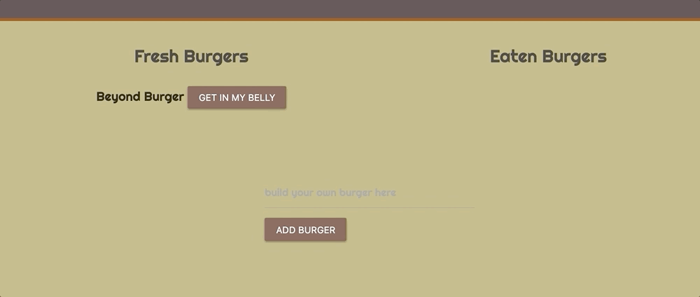
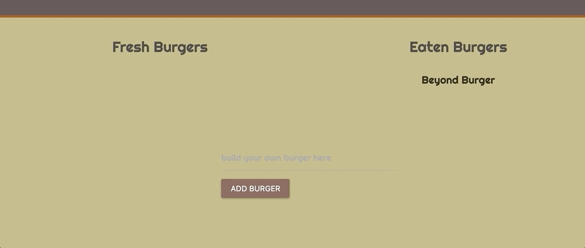
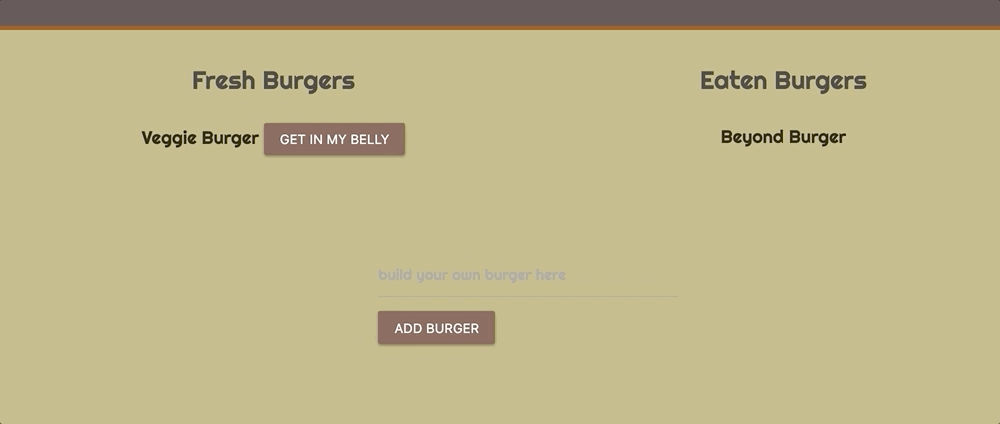
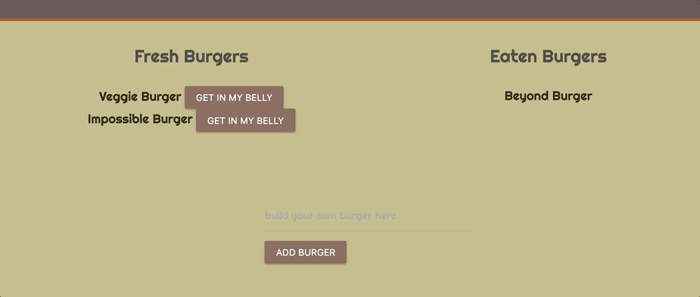

# Eat a Burger

**Link to App:**

# About:
Eat a Burger is a full stack application using MySQL, Node, Express, Handlebars, ORM (Object Relational Mapper). Node and MySQL are used to query and route data. Express is the backend web framework, and Handlebars is a templating language that is used to generate the HTML.

# How it works:
* Eat a Burger is a fun and simple application giving users the ability to create a burger and eat a burger 
* Once the user creates a burger, it is added to the "Fresh Burgers" list
* In the "Fresh Burgers" list, there is a "Get In My Belly" button next to the created burger, the user will click that button to eat their burger of choice
* Once the user eats a burger, that burger is added to the "Eaten Burgers" list

# Tools + Languages Used:
## Front-End Technologies:
* HTML
* CSS
* Materialize (https://materializecss.com/getting-started.html)
* JavaScript
* jQuery (https://jquery.com/)
* Handlebars (http://handlebarsjs.com/)

## Back-End Technologies:
* Node.js (https://nodejs.org/en/)
* MySQL (https://www.mysql.com/)
* Express (http://expressjs.com/)
* ORM (Object Relational Mapping)

# Features:

## Eat a burger:

## Make a new burger:

## Make however many burgers you want:

## Eat all the burgers:
